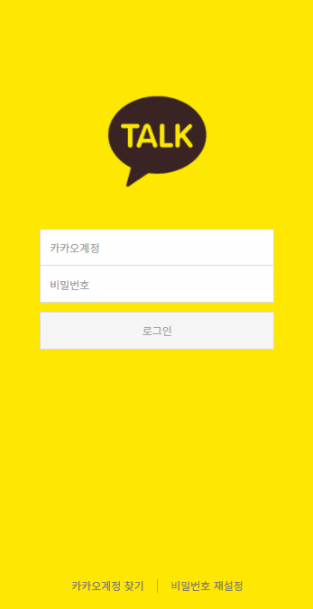

# 🔐 id,pw 입력 시 로그인 버튼 활성화 하기

``` 
  로그인, 회원가입과 같은 입력폼 페이지에서 데이터가 모두 입력되면
  하단 확인(다음,제출 등)버튼이 비활성화였다가 활성화되는 기능을 프론트에서 스크립트로 구현해보고자 한다. 
  복잡한 입력폼 페이지를 접하기 전에 간단한 로그인 페이지에서 먼저 구현 해보고자 한다.
```

<br><br>

## ⚙목표 구현 기능
#### 1️⃣ id,pw의 value값이 모두 true면 버튼 활성화 시켜준다.
#### 2️⃣ id,pw의 value값이 둘 중 하나라도 false면 버튼 비활성화 처리해준다. 
 
<br><br>

## ✅구현 방법

> html 구조
```html
<section class="contents login_contents">
        <div class="container">
            <!-- 유효성 검사 form_wrap_line 에 error 추가 -->
            <div class="form_wrap_line login_top">
                <div class="form-group-wrap">
                    <div class="form-group">
                        <input type="text" id="user_id" class="form-control box" placeholder="카카오계정" title="카카오계정">
                    </div>
                    <div class="form-group">
                        <input type="password" id="user_pw" class="form-control box" placeholder="비밀번호" title="비밀번호">
                    </div>
                </div>
                <div class="btn-group">
                    <button type="button" id="btn_login" class="btn btn_lg btn_primary" disabled>로그인</button>
                </div>
                <p class="caution">카카오계정 또는 비밀번호를 다시 확인해주세요</p>
            </div>
            <div class="btn-login-util">
                <button type="button" class="btn_find_id">카카오계정 찾기</button>
                <button type="button" class="btn_find_pw">비밀번호 재설정</button>
            </div>
        </div>
</section>

```
<br>

> 공통 변수 선언
``` javascript
const formWrap = document.querySelector('.form_wrap_line');
const idForm = document.querySelector('#user_id');
const pwForm = document.querySelector('#user_pw');
const loginButton = document.querySelector('#btn_login');

```
<br>

### 1. boolean함수를 이용한다.
```javascript

let idCheck = false;
let pwCheck = false;

const pushValue = () => {
  idForm.addEventListener('keyup', () => {
    idCheck = true
  });
  
  pwForm.addEventListener('keyup', () => {
    pwCheck = true
  });
}

pushValue();
```
- 코드가 길어진다.
- **한번 활성화된 버튼이 다시 비활성화로 돌아가지 않는다.**

<br>


### 2. pw 인풋박스 value값을 기준으로 true가 되면, 이벤트를 준다.
```javascript

const pushValue () => {
  pwForm.addEventListener('keyup', () => {
    if(idForm.value && pwForm.value){
      loginButton.disabled = false;
    } else {
      loginButton.disabled = true;
    }
  });
}

pushValue();
```
- 코드가 간결해진다.
- **pw input value값을 기준으로 하여 문제가 발생한다.**
   - id 값이 지워졌을 때, 버튼이 비활성화되지 않는다.
   - pw 값이 먼저 입력되고, id 값을 입력하면 버튼이 활성화되지 않는다.

<br> 

### 3. 이벤트 함수를 만들어서 이벤트를 부여해준다.  
```javascript
idForm.addEventListener('keyup', activeEvent);
pwForm.addEventListener('keyup', activeEvent);
loginButton.addEventListener('click', errorEvent);

function activeEvent() {
  switch(!(idForm && pwForm)){
    case true : loginButton.disabled = true; break;
    case false : loginButton.disabled = false; break
  }
}

function errorEvent() { // 이건 그냥 error 문구 출력해보려고 만들어봄.(신경안써도됨)
    formWrap.classList.add('error');
}

```
- id, pw 가 **모두** 입력됐을 때 ➡ ```!(true) = false``` ➡ 버튼 활성화 
- id, pw 중 **하나만** 입력됐을 때 ➡ ```!(false) = true``` ➡ 버튼 비활성화

<br><br>

## ✨최종 구현 결과


~~디자인이 심심해서 카톡 로그인 화면 참고함😅~~

~~유효성 검사는 error문구 출력해보려고 그냥 만들어봄😁~~

<br><br>


#### 참고 
https://velog.io/@rain98/TIL-id-pw-%EC%9E%85%EB%A0%A5-%EC%8B%9C-%EB%A1%9C%EA%B7%B8%EC%9D%B8-%EB%B2%84%ED%8A%BC-%ED%99%9C%EC%84%B1%ED%99%94-%EA%B8%B0%EB%8A%A5


https://velog.io/@najiexx/javascript-%EB%A1%9C%EA%B7%B8%EC%9D%B8-%EB%B2%84%ED%8A%BC-%ED%99%9C%EC%84%B1%ED%99%94

https://cocoon1787.tistory.com/700
