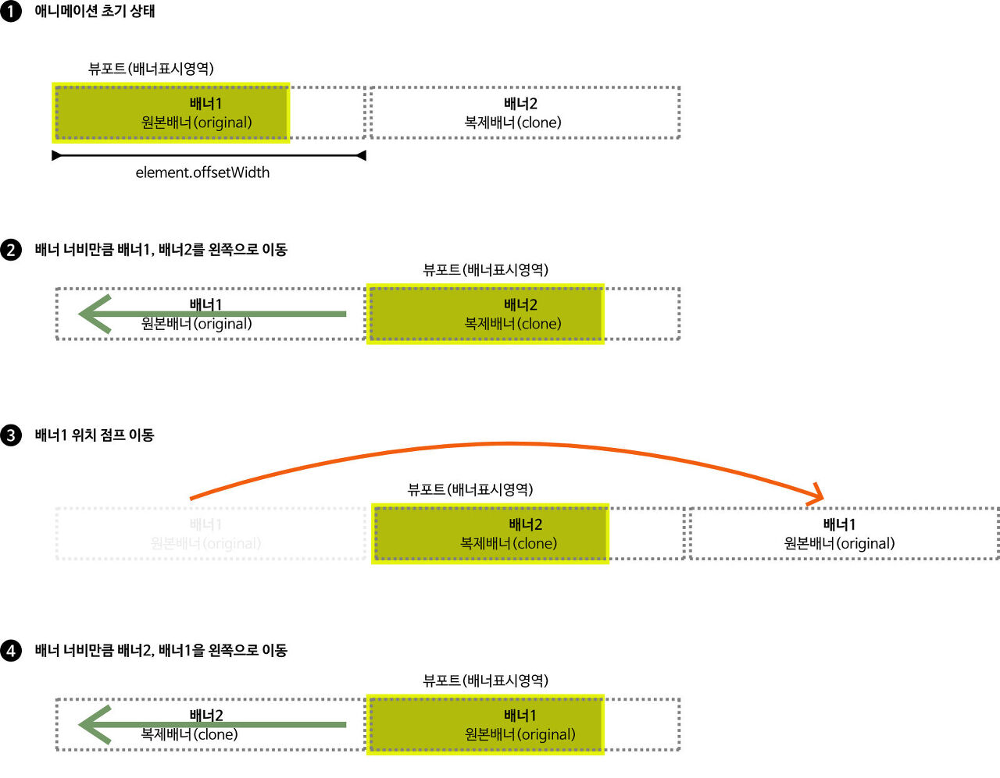

## [JS]흐르는 스타일의 무한 롤링 배너 만들기

무한 롤링 배너 종류 중 많은 아이템을 딜레이 없이 무한 회전시켜주는 스타일을 자바스크립트로 제작해보려 한다. 

<br>

### 무한 롤링 배너의 동작 방식 이해하기

- 무한 롤링 배너를 만들기 위해서는 2개의 배너가 필요하다. 자바스크립트를 이용해 복제 배너를 더 만들어 붙인다. 
- 기본적으로 배너 길이가 뷰포트 너비보다 길어야 자연스러운 배너 롤링이 구현된다.
- **복제 배너**는 원본 배너가 바깥 영역으로 완전히 이동하면서 생기는 **뷰포트의 빈공간을 채워 들어오는 역할**을 한다.
- 실제로는 같은 데이터를 가진 배너 2개가 번갈아가면서 뷰포트를 채우면서 왼쪽으로 이동하는 것이지만, 실제 동작은 하나의 배너가 무한 롤링을 하는 것처럼 보이게 되는 것이다.



<br>

### 구조잡기

> html

```html
<div class="container">
        <div class="rollingbanner">
            <div class="wrap">
                <div class="roller">
                    <ul>
                        <li>
                            
                        </li>
                        <li>
                            
                        </li>
                        <li>
                            
                        </li>
                        <li>
                            
                        </li>
                        <li>
                            
                        </li>
                        <li>
                            
                        </li>
                    </ul>
                </div>
            </div>
        </div>
    </div>

```

<br>

> css

```css
<!-- reset style -->
html, body{
	width: 100%;
	height: 100%;
	padding: 0;
	margin: 0;
	box-sizing: border-box;
}
ol,ul,li{
	list-style: none;
}

.rollingbanner {
	position: relative;
	width: 1200px;
	height: 600px;
	margin: 0 auto;
	overflow: hidden;
}
.roller{
	position: absolute;
	height: 100%;
}
.roller > ul{
	display: flex;
	padding: 0;
}
.roller > ul > li {
	padding-right: 30px;
}

```

<br>


